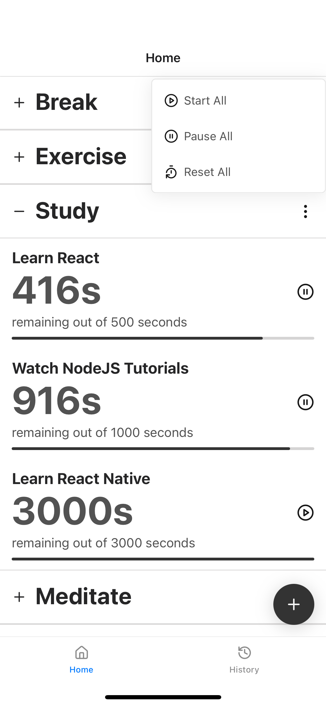
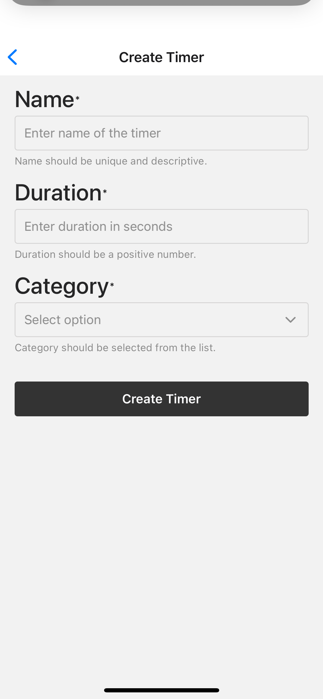
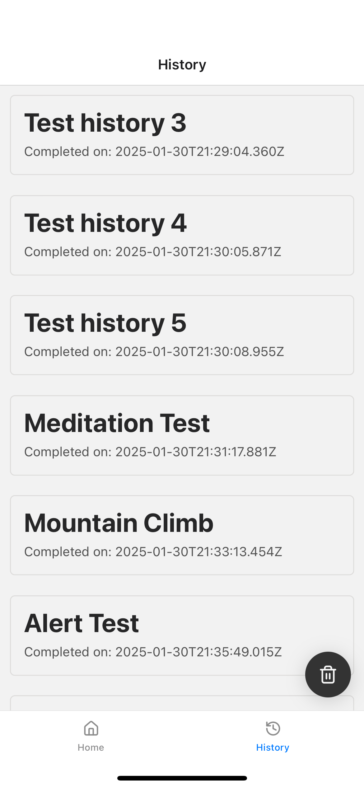
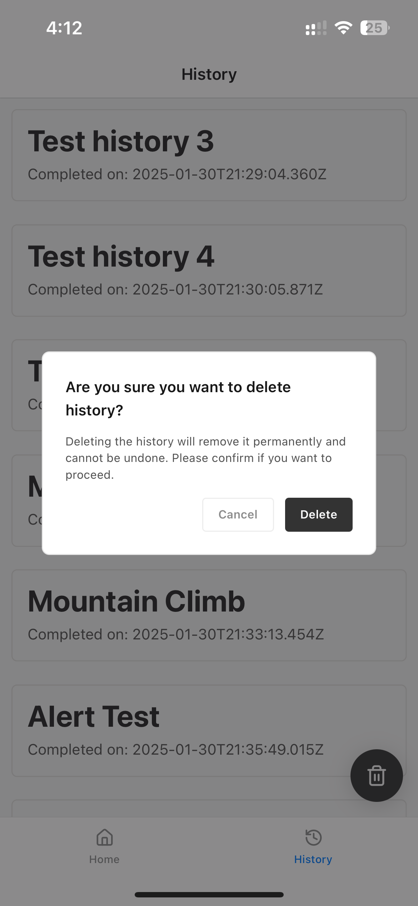

# Timer App

This is a simple timer app that allows you to set multiple timers for different categories. It is built in React Native with Expo and uses Gluestack for UI.

## Features

- Set multiple timers
- Set timers for different categories
- Start, pause, and reset timers
- View all timers in a list
- View all completed timers in a list

## Installation

1. Clone the repository
2. Run `npm install` to install dependencies
3. Run `npx expo start` to start the app

## Screenshots

Here are some screenshots of the app:

### Home Screen

### Create Timer

### History

### Delete History

Note: The app is developed in limited enviroment and may not work as expected in all devices. Application is only tested in Expo IOS platform.

## Libraries Used

- React Native
- Expo
- Gluestack
- React Navigation
- UUID
